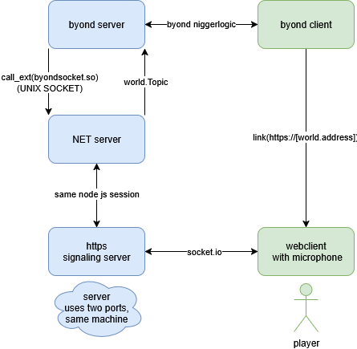

### BUILDING
I dont understand juke build so you will have to run a few commands manually.
1. ensure you have **g++-multilib** and **npm** installed
	* `sudo apt install g++-multilib npm -y`
2. build **byondsocket.so** library
	* to talk to node from byond I use [unix sockets](https://en.wikipedia.org/wiki/Unix_domain_socket) and so we make a simple library to send stuff through an existing socket from byond.
	* `cd voicechat/pipes && make`
	* the only thing stopping me from making this crossplatform, is that I couldnt figure out how to make DLL for windows.
3. install **node dependencies**
	* I dont understand TGS well enough sp I use something more retard proof like node to handle signaling and hosting static webpage
	* if your still in voicechat/pipes `cd ../node && npm install`
	* if not get back to the voicechat (this directory) `cd voicechat/node && npm install`
4. verify it worked
	* to **test node**, run `node voicechat/node/server/main.js`
	* if it worked it should run but with message about missing arguements
	```
	HTTPS server running on port undefined
	socket server listening on /tmp/byond_node.sock
	Failed to send command: The "options" or "port" or "path" argument must be specified
	```
	* to **verify the library** you can do `ldd byondsocket.so`
	and it should return something along the lines of (with different numbers):
	```
	linux-gate.so.1 (0x111111)
	libgcc_s.so.1 => /lib/i386-linux-gnu/libgcc_s.so.1 (0123546)
	libc.so.6 => /lib/i386-linux-gnu/libc.so.6 (0x1234567)
	/lib/ld-linux.so.2 (0x42069)
	```
	* additionally you can use debug mode while running the game to see if the library is compiles right.
5. If your too retarded to follow this (no worries man), or you cant figure out what went wrong you can contact **a_forg** on discord.


### general architecture (pardon the profanity)
* right now distance is calculated at **O(N^2)**
* using a spatial indexing library like [rbush](https://github.com/mourner/rbush), it might be possible to get it down to **O(N * log(N) + idk)**
* roughly 10% of rtc connections fail with the current setup, If your smart enough maybe you can set up a local [TURN](https://webrtc.org/getting-started/turn-server) server so they dont.

